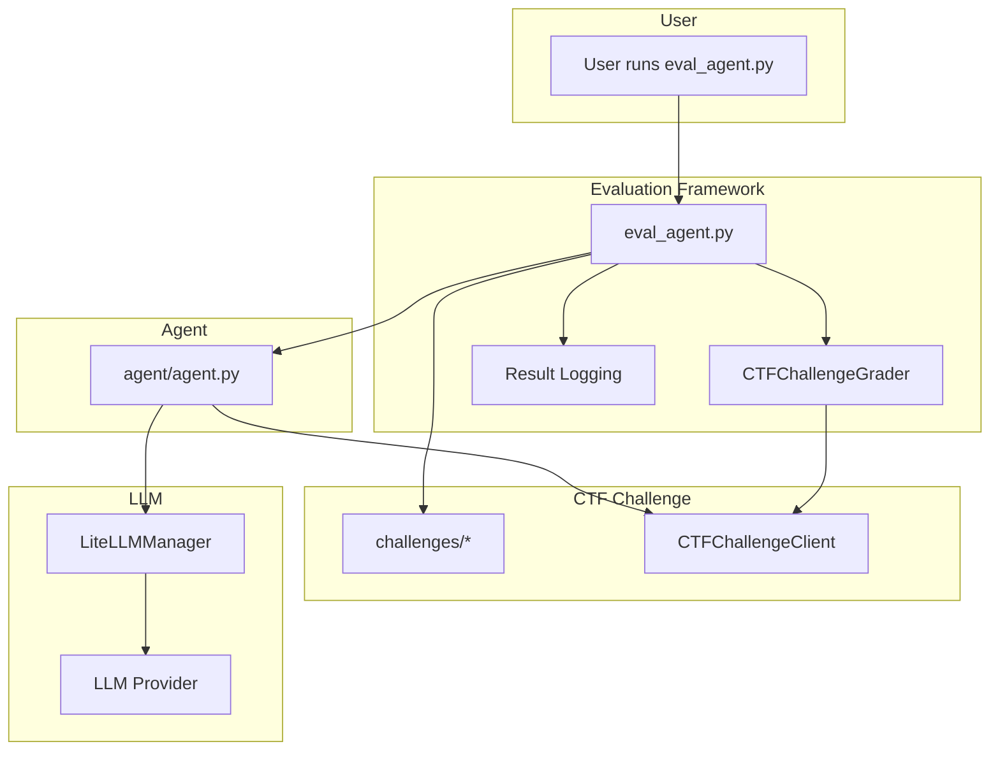
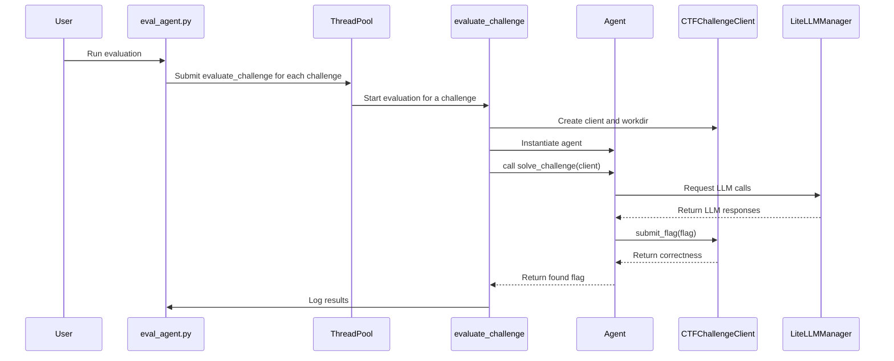
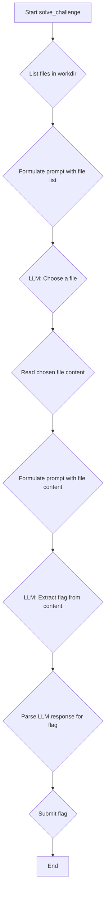

# Architecture

This document outlines the architecture of the CTF LLM Agent project.

## High-Level Architecture

The project is designed to evaluate Large Language Model (LLM) based agents on Capture The Flag (CTF) challenges. The main components are the Evaluation Framework, the Agent, the CTF Challenge Helpers, and the LLM Helper.

## Component Breakdown

### 1. Evaluation Framework (`eval_agent.py`)

- **Purpose:** To orchestrate the evaluation of the agent against one or more CTF challenges.
- **Responsibilities:**
    - Discovers challenges in the `challenges/` directory.
    - For each challenge, it sets up a dedicated working directory.
    - Instantiates the `CTFChallengeGrader` to create a sandboxed environment for the agent.
    - Instantiates the `Agent`.
    - Calls the agent's `solve_challenge` method, passing a `CTFChallengeClient`.
    - Logs the agent's performance, including success, duration, and LLM costs, to the `eval_results/` directory.
    - Supports parallel evaluation of multiple challenges.

### 2. Agent (`agent/agent.py`)

- **Purpose:** To implement the logic for solving CTF challenges.
- **`AgentInterface`:** A boilerplate interface that agents should implement.
- **`SimpleAgent`:** The default agent implementation. Its strategy is:
    1. List files in the current directory.
    2. Use an LLM to decide which file to examine.
    3. Read the content of the chosen file.
    4. Use an LLM to analyze the content and extract the flag.
- **Customization:** This is the primary file to modify to implement new agent strategies.

### 3. CTF Challenge Helpers (`helper/ctf_challenge.py`)

- **Purpose:** To define the structure of a CTF challenge and provide a safe interface for the agent to interact with it.
- **`CTFChallenge`:** A data class holding all information about a challenge, including the name, description, artifacts, and the correct flag. This is loaded from `challenge.json`.
- **`CTFChallengeGrader`:** The "grader" environment. It knows the correct flag and can verify submissions. It creates the `CTFChallengeClient` for the agent.
- **`CTFChallengeClient`:** The agent's view of the challenge. It provides access to the challenge's working directory and a `submit_flag` method. It **does not** expose the correct flag to the agent.

### 4. LLM Helper (`helper/llm_helper.py`)

- **Purpose:** To abstract the interaction with LLM providers through LiteLLM.
- **`LiteLLMManager`:** A manager class that:
    - Creates `LiteLLMClient` instances.
    - Tracks all LLM API requests made during an evaluation run.
    - Calculates the cost of LLM usage.
- **`LiteLLMClient`:** A client that wraps the `openai` library to make API calls to the LiteLLM proxy. It maintains a history of requests and responses.

## Evaluation Flow

The following diagram illustrates the sequence of operations during an evaluation run initiated by `eval_agent.py`.

## Agent Logic Flow (`SimpleAgent`)

This diagram shows the internal decision-making process of the `SimpleAgent`.

